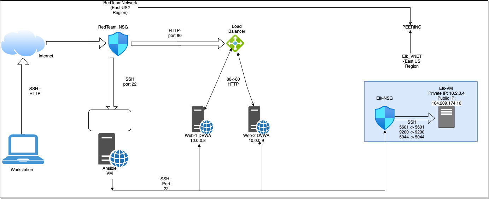

## Automated ELK Stack Deployment

The files in this repository were used to configure the network depicted below.



These files have been tested and used to generate a live ELK deployment on Azure. They can be used to either recreate the entire deployment pictured above. Alternatively, select portions of the playbook file may be used to install only certain pieces of it, such as Filebeat.

  - [Filebeat Install](https://github.com/Ucheonyekpe1984/Scripts/blob/main/Ansible/FilebeatPlaybook.yml)
  - [Metricbeat Install](https:github.com/Ucheonyekpe1984/Scripts/blob/main/Ansible/Metricbeat-playbook.yml)
  - [ELK Install](https:github.com/Ucheonyekpe1984/Scripts/blob/main/Ansible/ELK-Playbook.yml)

This document contains the following details:
- Description of the Topology
- Access Policies
- ELK Configuration
  - Beats in Use
  - Machines Being Monitored
- How to Use the Ansible Build


### Description of the Topology

The main purpose of this network is to expose a load-balanced and monitored instance of DVWA, the D*mn Vulnerable Web Application.

Load balancing ensures that the application will be highly available, in addition to restricting access to the network.
Load balancers help to ensure availability through the distribution of incoming data to web servers. Jump boxes allow for a more administration of multiple systems and provide an additional layer between the outside and internal assets.

Integrating an ELK server allows users to easily monitor the vulnerable VMs for changes to the event logs and system metrics.
- Filebeats watch for log directories or specific log files
- Metricbeats helps you monitor your servers by collecting metrics from the system and services running on the server

The configuration details of each machine may be found below.

| Name      | Function  | IP Address | Operating System |
|---------- |---------- |------------|------------------|
| Jump Box  | Gateway   | 10.0.0.1   | Linux(Ubuntu     |
| Web 1     | Server    | 10.0.0.8   | Linux(Ubuntu)    |
| Web 2     | Server    | 10.0.0.9   | Linux(Ubuntu)    |
| ELK Server| Log Server| 10.2.0.4   | Linux(Ubuntu)    |

Access Policies

The machines on the internal network are not exposed to the public Internet. 

Only the jump box provisioner machine can accept connections from the Internet. Access to this machine is only allowed from the following IP addresses:
- local IP addresses

Machines within the network can only be accessed by the Jump Box.
- The Elk Machine can have access from local IP address through port 5601

A summary of the access policies in place can be found in the table below.

| Name      | Publicly Accessible | Allowed IP Addresses |
|-----------|---------------------|----------------------|
| Jump Box  | Yes                 | Local IP address     |
| Web 1     | No                  | 10.0.0.8             |
| Web 2     | No                  | 10.0.0.9             |
| Elk Server| Yes                 | Local IP address     |

### Elk Configuration

Ansible was used to automate configuration of the ELK machine. No configuration was performed manually, which is advantageous because...
- Services running can be limited,system installation and update can be streamlined and processes become more applicable.

The playbook implements the following tasks:

-Installs docker.io,pip3,and the other docker module

```bash
  # Use apt module
    - name: Install docker.io
     apt:
       update_cache: yes
       name: docker.io
       state: present

  # Use apt module
    - name: Install pip3
     apt:
       force_apt_get: yes
       name: python3-pip
       state: present

  # Use pip module
    - name: Install Docker python module
      pip:
        name: docker
        state: present
```

- increases the virtual memory (for the virtual machine that would run the ELK server)
```bash
  # Use command module
    - name: Increase virtual memory
      command: sysctl -w vm.max_map_count=262144 
```
 - uses sysctl module
```bash   
  # Use sysctl module
    - name: Use more memory
      sysctl:
        name: vm.max_map_count
        value: "262144"
        state: present
        reload: yes
```
 - downloads and launches the docker container for elk server
```bash
  # Use docker_container module
      - name: download and launch a docker elk container
        docker_container:
        name: elk
        image: sebp/elk:761
        state: started
        restart_policy: always
        published_ports:
          - 5601:5601
          - 9200:9200
          - 5044:5044
```


The following screenshot displays the result of running `docker ps` after successfully configuring the ELK instance.


### Target Machines & Beats

This ELK server is configured to monitor the following machines:
- Web 1 (10.0.0.8)
- Web 2 (10.0.0.9)

We have installed the following Beats on these machines:
- Filebeat
- Metricbeat

These Beats allow us to collect the following information from each machine:
- Filebeat allows us to collect log data: It also monitors the log directories or specific log files, tails the files and forwards them either to the Elastic search or logstach for indexing
- Metricbeat collects metrics and statictics on the system.

### Using the Playbook
In order to use the playbook, you will need to have an Ansible control node already configured. Assuming you have such a control node provisioned: 

SSH into the control node and follow the steps below:
- Copy the configuration file to the Web virtual Machines
- Update the host file to include IP addresses of the webservers and Elk server
- Run the playbook, and navigate to http://[Elk_VM_Public_IP]:5601/app/kibana to check that the installation worked as expected.

_ Answer the following questions to fill in the blanks:_

  Which file is the playbook? The Filebeat-configuration

- Where do you copy it? /etc/ansible/files/filebeat-config.yml to /etc/filebeat/filebeat.yml

  Which file do you update to make Ansible run the playbook on a specific machine? Filebeat-config.yml

- How do I specify which machine to install the ELK server on versus which to install Filebeat on? This is done by updating the host files with the IP addresses of web/elk servers and selecting which group to run on in the machine


- Which URL do you navigate to in order to check that the ELK server is running? http://[your_ELK_VM_External.IP]:5601/app/kibana

_As a **Bonus**, provide the specific commands the user will need to run to download the playbook, update the files, etc._

- Filebeats
```bash
 - name: Installing and Launch Filebeat
  hosts: webservers
  become: true
  tasks:
    # Use command module
  - name: Download filebeat .deb file
    command: curl -L -0 https://artifacts.elastic.co/downloads/beats/filebeat/filebeat-7.4.0-amd64.deb

    # Use command module
  _ name: Install filebeat .deb
    command: dpkg -i filebeat-7.4.0-amd64.deb

    # Use copy module
  - name: Drop in filebeat.yml
    copy:
      src: /etc/ansible/files/filebeat-config.yml
      dest: /etc/filebeat/filebeat.yml
  
    # Use command module
  - name: Enable and Configure System Module
    command: filebeat modules enable system

    # Use command module
  - name: Setup filebeat
    command: filebeat setup

    # Use command module
  - name: Start filebeat service
    command: service filebeat start

```

 - Metricbeats
```bash
 - name: Install metric beat
  hosts: webservers
  become: true
  tasks:
    # Use command module
  - name: Download metricbeat
    command: curl -L -0 https://artifacts.elastic.co/downloads/beats/metricbeat/metricbeat-7.4.0-amd64.deb

    # Use command module
  - name: install metricbeat
    command: dpkg -i metricbeat-7.4.0-amd64.deb

    # Use copy module
  - name: drop in metricbeat config
    copy:
      src: /etc/ansible/files/metricbeat-config.yml
      dest: /etc/metricbeat/metricbeat.yml

    # Use command module
  - name: enable and configure docker module for metric beat
    command: metricbeat modules enable docker

    # Use command module
  - name: setup metric beat
    command: metricbeat setup

    # Use command module
  - name: start metric beat
    command: service metricbeat start
 ```
